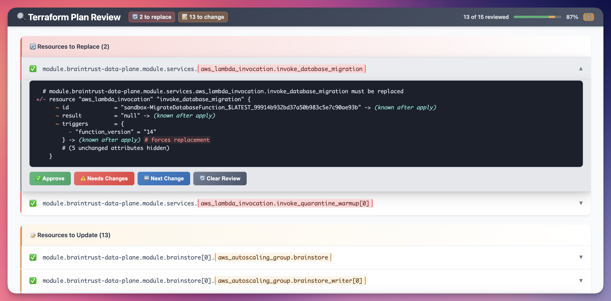

# TFReview 🔍

View your Terraform plan in an beautiful and easy to use HTML interface.

Staring at reams of monospace text in a terminal is so 1985. Let TFReview blast your terraform experience into a modern future! (the late 90s)

Pipe your terraform plan output to it and it will open something readable by humans in a browser: `terraform plan | tfreview`



https://github.com/user-attachments/assets/308543e0-939a-422a-977e-c3e4bb098e77

## Features ✨

- **Collapsible Resource Views**: Organize changes with expandable sections for each resource
- **Syntax Highlighting**: Color-coded terraform diff output for easier reading
- **Review Tracking**: Mark resources as approved or needing changes with progress tracking (browser local)
- **Easy Review Workflow**: Read, Click, Read, Click, Read, Click
- **Entirely built using AI**: I beg you not to look at the commit history.

## Installation 📦

### From source

```bash
git clone https://github.com/braintrustdata/tfreview.git
cd tfreview
pip install -e .
```

## Quick Start 🚀

### Basic Usage

```bash
# Review a terraform plan file
terraform plan -no-color | tfreview
terraform show tfplan | tfreview

# Or save plan to text file first
terraform show tfplan > plan.txt
tfreview plan.txt
```

### Command Line Options

```bash
# Specify output file
tfreview plan.txt -o my-review.html

# Don't open browser automatically
tfreview plan.txt --no-browser
```

## License 📄

This project is licensed under the MIT License - see the [LICENSE](LICENSE) file for details.

## Roadmap 🗺️

- [ ] **CI/CD Integration**: GitHub Action to run and post results to a PR as clickable comment
- [ ] **Easier installation**: Definitely want to switch to `uv` but the AI barely understands `uv`. Maybe I just ask it to rewrite it in Go.

# Credits
Built entirely with AI in Cursor using plain english. The code quality matches my will to live after reviewing thousands of Terraform plans manually. Technically functional but deeply concerning. You're welcome.

Seriously though, as horribly frustrating vibe coding is, I never would have built this myself without it. Vibe coding solved a long standing problem for me for $20/month (+ some mental anguish).
